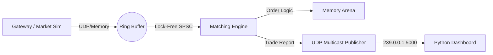

The content you need to paste into your `README.md` file is the Markdown code block below.

Copy everything inside the box and paste it into VS Code:

```markdown
# ⚡ Titan-HFT: Ultra-Low Latency Trading Engine

**Titan-HFT** is a simulation of a high-frequency trading (HFT) exchange engine designed for sub-microsecond latency. It demonstrates advanced systems engineering concepts including **Lock-Free Concurrency**, **Mechanical Sympathy**, **Cache Locality**, and **Zero-Allocation** memory management.


---

## 📖 Overview

Standard trading systems use general-purpose structures like `std::map` or `std::mutex`, which introduce cache misses and context switches. Titan-HFT abandons these for a raw, bare-metal approach:
* **No Locks:** Uses `std::atomic` and Single-Producer Single-Consumer (SPSC) Ring Buffers.
* **No Runtime Allocation:** Uses a linear **Arena Allocator** (Object Pool) to prevent `malloc` jitter.
* **CPU Pinning:** Optimizes for L1/L2 cache hits using `alignas(64)` to prevent false sharing.

### System Architecture
The system operates as a pipelined architecture running on isolated threads:



---

## 🚀 Key Features

* **Lock-Free Ring Buffer:** Custom SPSC queue using `memory_order_acquire` / `memory_order_release` semantics.
* **Deterministic Memory:** Pre-allocated 1GB Memory Arena. O(1) allocation/deallocation overhead.
* **Intrusive Data Structures:** Orders contain their own linked-list pointers to maximize cache density.
* **Real-Time Visualization:** Python dashboard using UDP Multicast to plot live price action and volume.
* **Crypto Live Feed:** Optional gateway to fetch real-time data from Binance WebSockets.

---

## 🛠️ Prerequisites

This project is optimized for **Linux** environments (or WSL on Windows) due to its use of POSIX sockets and specific memory layouts.

* **OS:** Ubuntu 20.04+ or WSL2.
* **Compiler:** GCC 9+ or Clang (supporting C++17).
* **Build System:** CMake 3.10+.
* **Python:** Python 3.8+ (for dashboard/gateway).

### Dependencies

```bash
# C++ Build Tools
sudo apt update
sudo apt install build-essential cmake

# Python Visualization Libs
sudo apt install python3-pip python3-tk
pip3 install matplotlib websocket-client

```

---

## 🏗️ Build Instructions

1. **Clone the repository:**
```bash
git clone [https://github.com/yourusername/Titan-HFT.git](https://github.com/yourusername/Titan-HFT.git)
cd Titan-HFT

```


2. **Compile the Engine:**
```bash
mkdir build && cd build
cmake ..
make

```


*Output executable `titan_engine` will be created in the `build/` directory.*

---

## 🖥️ How to Run

For the full experience, you need to run three components in separate terminals.

### 1. Start the Dashboard (Terminal 1)

Starts the listener for the UDP Multicast feed.

```bash
python3 dashboard.py

```

*A window should pop up (empty at first).*

### 2. Start the Engine (Terminal 2)

The core C++ logic. It processes orders and multicasts the results.

```bash
cd build
./titan_engine

```

### 3. Start the Feed (Terminal 3)

**Option A: Internal Simulation (Default)**
If you haven't changed `main.cpp`, the engine runs a built-in random walk simulator automatically. You don't need a third terminal.

**Option B: Live Binance Feed**
If you configured `main.cpp` to listen on UDP Port 9999 (as per the "Live Data" guide):

```bash
python3 gateway.py

```

---

## 📂 Project Structure

| File | Description |
| --- | --- |
| **`main.cpp`** | Entry point. Contains the Producer (Gateway) and Consumer (Matcher) threads. |
| **`arena.h`** | Custom O(1) linear memory allocator. |
| **`ring_buffer.h`** | Lock-free SPSC queue implementation. |
| **`order.h`** | Cache-aligned data structures with intrusive pointers. |
| **`dashboard.py`** | Real-time visualization tool (Matplotlib). |
| **`gateway.py`** | Python bridge to fetch Binance WebSocket data. |
| **`CMakeLists.txt`** | Build configuration. |

---

## ⚡ Performance Optimization

To achieve true HFT performance, this engine uses:

* **`alignas(64)`**: Ensures `head` and `tail` indices of ring buffers sit on different cache lines.
* **`taskset` / `isolcpus**`: (Advanced) Can be used to pin the matching thread to a specific isolated CPU core to prevent OS scheduler interruptions.
* **Kernel Bypass**: (Future) Implementation using DPDK or Solarflare OpenOnload.

---

## 📜 License

Distributed under the MIT License. See `LICENSE` for more information.

```

```
